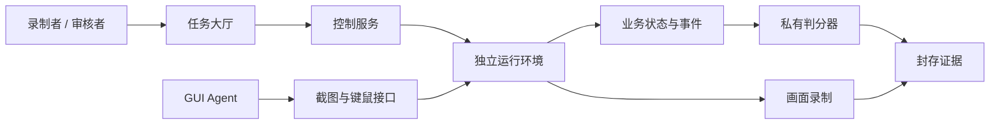

# 实现范围与交付规格

## 平台执行链

本地开发表面由一个 Chromium 进程中的独立 BrowserContext 和每次运行独立 SQLite 文件组成。控制服务使用 SQLite 或 PostgreSQL。业务状态、录像和封存证据位于本地卷；多节点存储、队列和统一身份服务需要单独接入。

管理凭证负责创建、重置、判分和审核。Agent 凭证仅限单个运行的截图与输入；应用操作凭证与 Agent 凭证相互独立。示范规则仅出现在录制者规则卡及录像字幕。公开执行画面包含任务目标与对象属性，私有 evaluator 持有规则版本与正确结果。

执行记录包含任务摘要、初始状态摘要、六个来源提交、实际服务与前端构建指纹、Python 和核心依赖版本。正式冻结还需要系统镜像摘要、浏览器镜像摘要、输入网关版本及审核视频摘要。

## 原应用模块

| 模块 | 任务编号 | 容器运行能力 | 正式任务交付要求 |
|---|---|---|---|
| `apps/chat` | 1–14 | Django ASGI、React、HTTP/WebSocket 代理、独立数据库路径 | 消息/会话/联系人/附件的真实动作；标签、状态、顺序；每题初始化与状态读取 |
| `apps/im` | 15–16 | Django ASGI、Next.js、HTTP/WebSocket 代理、独立数据库路径 | 真实群成员关系、消息阅读状态、星标和指定回复 |
| `apps/music` | 17、18、22、27、28、32 | Django ASGI、独立数据库路径 | 固定音乐库、评分与播放属性、别名编辑、标签、列表成员及顺序 |
| `apps/news` | 19、20、23、24、29、30、33 | Java HTTP 服务、本地新闻快照 | 持久化文章、元数据编辑、标签与阅读状态、完整查询语义 |
| `apps/code` | 58–65 | FastAPI、Streamlit、独立数据库；判题默认禁用 | 代码编辑/标签 UI、检查事件、真实提交；独立受限执行容器与限额 |
| `apps/gomoku` | 66–67 | C++/SDL、Xvfb、noVNC | 原棋盘可初始化、任务模式、候选点与标注、只读 IPC 状态适配器 |

六个来源模块均可作为独立开发部署启动。正式任务认证数量为 0；它们尚未通过控制服务分配任务、初始化及原生判分的完整链路。

## 新业务模块规格

以下目录是目标模块边界；其任务规则已进入开发工作台，独立领域应用尚待实现。

| 目标模块 | 任务 | 最小业务模型 | GUI 与判分证据 |
|---|---|---|---|
| `apps/media` | 21、25、26、31、34、35 | Video、Series、History、Favorite、QueueEntry | 标题编辑、筛选、收藏/删除、队列排序；对象值和有序成员 |
| `apps/blog` | 36、38、40、42 | Post、Draft、Tag、Publication | 编辑器、列表、标签、发布；内容与发布事件 |
| `apps/studio` | 37、39、41、43 | Document、ModelCard、CheckRun、Delivery | 编辑、模型选择、检查、保存/复制/发送；检查先后关系和实际产物 |
| `apps/travel` | 44、47、51、54 | Traveler、Itinerary、Booking | 姓名编辑、行程筛选、确认预订；所选行程与预订记录 |
| `apps/shop` | 45、48、52、55 | Product、Label、CartLine、Favorite | 商品命名、标签、筛选、购物车；购物车增删与收藏关系 |
| `apps/bank` | 46、49、50、53、56、57 | Account、Transaction、LedgerEntry、Reminder | 账号显示、分类、选择、转账及提醒；双向账本、余额守恒与提醒范围 |
| `apps/games` | 68–75 | Board、Move、Annotation、StopEvent | 2048、数独、扫雷、黑白棋的独立游戏 UI；棋盘与完整合法操作序列 |

各模块须具备版本化迁移、确定性种子初始化、正常业务 API 与 GUI、客体外状态适配器。业务 API 不提供规则名、正确答案、直接完成任务端点。复制由客体剪贴板采集；转账由原子事务记账；删除需验证集合和副作用；多对象操作须检查全部目标。

## 系统执行模块规格

| 运行池 | 任务 | 运行依赖 | 任务接入要求 |
|---|---|---|---|
| Windows | 76–90 | x86_64 Linux/KVM、固定 Windows 镜像与授权、独立写入层、NVRAM/TPM | Explorer、属性/格式、应用设置、文件操作等客体脚本与只读判分 |
| Linux | 92–98 | 固定桌面 Linux 镜像、libvirt、独立写入层 | 真实桌面和文件系统、任务初始化与状态采集 |
| Android | 91、99、100 | Android Emulator、ADB、固定 AVD 与快照 | 独立 AVD/端口、触控输入、界面/系统状态采集 |

`runtimes/worker.py` 提供真实 libvirt/AVD 生命周期及截图。输入转发、系统题初始化/判分、网络隔离、Worker 调度与录制通道仍属于系统接入工作。Windows UEFI 模板必须具备实例级 NVRAM/TPM 隔离；服务会拒绝共享 NVRAM 模板。

## 交付顺序与验收出口

1. **平台开发链路**：目录、实例隔离、像素输入、录像、私有判分、证据与前端可运行；容器版和本地版分别验证。
2. **原应用纵向接入**：每个模块先完成一题的初始化 → GUI 操作 → 原生状态判分，再扩展至对应任务集。任何数量统计均以端到端验收题目计数。
3. **独立领域应用**：按媒体、内容、交易与游戏模块实现业务语义；三种规则分别通过正确轨迹、错误轨迹及反事实测试。
4. **系统执行池**：固定实验室主机与镜像，完成一个 Windows 文件题、一个 Linux 文件题和一个 Android 设置题，再扩展其余题目。
5. **数据集生产**：同事录制 300 段教程，审核动作可辨识性、规则可推断性、结果正确性和数据划分；自动测试录像不得替代人工教程。
6. **正式基准冻结**：经过认证的原生表面、固定镜像、冻结规则、审核视频和完整证据一起形成发布版本。
