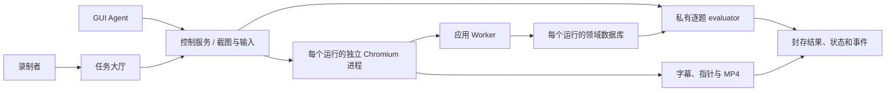

# 应用基准架构

## 执行边界

控制服务持有规则和标准结果；应用 Worker 执行业务操作，只接收初始化状态、运行编号和应用凭证。Agent 仅获得单个运行的截图与键鼠权限。应用凭证与 Agent 凭证不同，管理接口、业务接口和模型接口互不通用。

## 应用模块

| 应用 | 录制界面 | 会话连接方式 |
|---|---|---|
| Chat | 来源 React/Vite 组件、通讯录、会话、消息与输入框 | 原 API 形状到独立业务库的适配器 |
| IM | 来源 Next.js/Ant Design 页面 | 原 API 形状到独立业务库的适配器 |
| Music | 来源 Django 首页、歌曲与歌手模板；资料库面板 | Django 模板渲染与独立业务库 |
| Code | 来源 Streamlit 题目、提交与导航页面；代码笔记面板 | 每个运行独立 Streamlit 进程，HTTP/WebSocket 代理 |
| News | Java 仓库新闻页面资源、新闻首页与阅读编辑面板 | 页面业务请求直接写入独立业务库 |
| 五子棋 | 来源 C++/SDL 棋盘与棋谱入口 | 每个运行独立 Xvfb、SDL、VNC；鼠标意图写入事务 |
| Media、Blog、Studio、Travel、Shop、Bank | 各应用的首页、导航、列表、详情与业务操作 | 共享认证与命令协议，独立领域数据 |
| Games | 游戏大厅与 2048、数独、扫雷、黑白棋 | 合法棋盘动作与领域事务 |

应用入口为 `/apps/{module}/{run_id}`，打开后进入应用默认首页。开发诊断界面需要显式添加 `?diagnostic=1`，不用于正式录制。录制服务要求在应用入口开始。

原生应用经同一个 Worker 服务连接，Cookie 按运行路径隔离。Code 与五子棋进程合计容量为 12；录制结束封存输入，评测完成释放进程，重置和销毁也会释放进程。普通模式的六个独立入口见 `infra/compose.native.yaml`；任务录制使用 `infra/compose.yaml`。

会话使用固定资料、模拟身份与独立业务数据。功能验收覆盖题目所需操作；真实支付、外部账号连接、任意代码执行和原仓库全部功能不属于自动化通过声明。任务首页包含完整业务说明，分类菜单使用页面内控件，支持截图与坐标输入。

## 业务数据与判分

| 数据 | 业务含义 | 判分方式 |
|---|---|---|
| `objects` | 联系人、会话、歌曲、文章、产品、路线、代码等领域对象 | 目标字段满足规则，非目标字段保持一致 |
| `messages` | 收发消息、转发引用、固定回复、附件引用 | 收件人、正文、引用及消息数量一致 |
| `memberships` | 群组与成员关系 | 主账户和指定三名联系人，拒绝额外成员 |
| `collection_entries` | 播放列表、观看列表、历史、收藏、购物车、阅读清单 | 对应集合的增删及非目标集合不变 |
| `ledger`、`balances` | 双边转账流水与账户余额 | 收款人及金额正确、借贷平衡、余额守恒 |
| `domain_values` | 有序列表、设置、交付产物、检查记录、附件内容 | 顺序、状态、检查先后、内容与完整性 |
| `events` | 应用接受的普通操作及幂等编号 | 过程约束、额外动作、合法棋盘重放 |
| 客体剪贴板 | 浏览器实际复制结果 | 最终剪贴板与最近一次有效复制相同 |

附件有实际字节内容和 SHA-256 摘要，可通过受应用凭证保护的文件接口读取。代码题采用文本规则、AST 绑定／结构及 Python 语法检查；控制服务不执行用户提交的任意代码。

`services/control/vic/application_eval.py` 校验完整领域结果。`services/control/vic/games.py` 校验棋盘规则并重放实际动作，拒绝与动作轨迹不一致的棋盘。每个任务和规则版本由独立契约编号引用，HTTP 入口统一为 `/v1/tasks/{task_id}/eval`。

## 生命周期

- 创建：固定任务版本与种子，生成领域状态，建立独立数据库和运行凭证。
- 操作：应用事务写入真实业务表；重复动作编号幂等，跨实例对象不可访问。
- 录制停止：完成编码并封存应用输入；视频超时或编码失败不能作为完整教程审核。
- 判分：封存状态与事件，核对业务结果、过程约束及实际剪贴板，保存最终截图并释放浏览器。
- 重置：归档对应 epoch 的状态、事件、录像和结果，增加 epoch，轮换应用凭证并初始化同一题目状态。
- 销毁：关闭浏览器并移除可写应用数据库，保留封存证据。

## 复现信息

证据包含任务摘要、初始状态摘要、来源提交、应用与判分代码指纹、前端构建、Python 和核心依赖版本。演示、开发和评测使用分离的种子范围；应用对象 ID 随种子变化。

## 系统题范围

任务 76–100 的 eval 请求结构、结果结构、规则版本及系统状态读取字段见 `tasks/contracts/076.json` 至 `100.json`。系统执行池、初始化和系统状态判分适配为 `deferred-system`，不纳入 75 题录制范围。

`runtimes/worker.py` 提供 libvirt/Android 生命周期的基础接口。Windows/Linux/Android 的真实镜像、输入通道和逐题状态采集需要实验室执行主机；该交付项可以独立推进。
