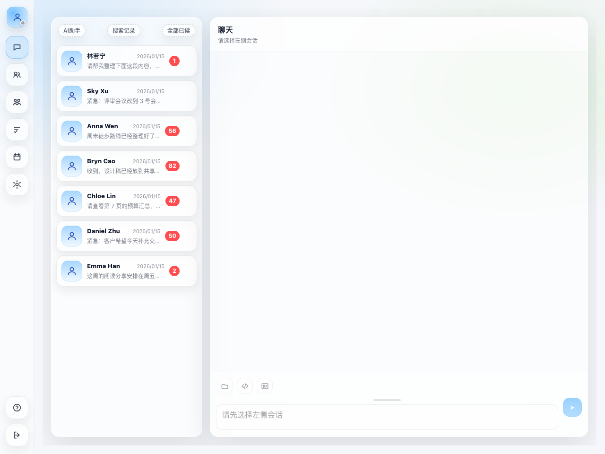
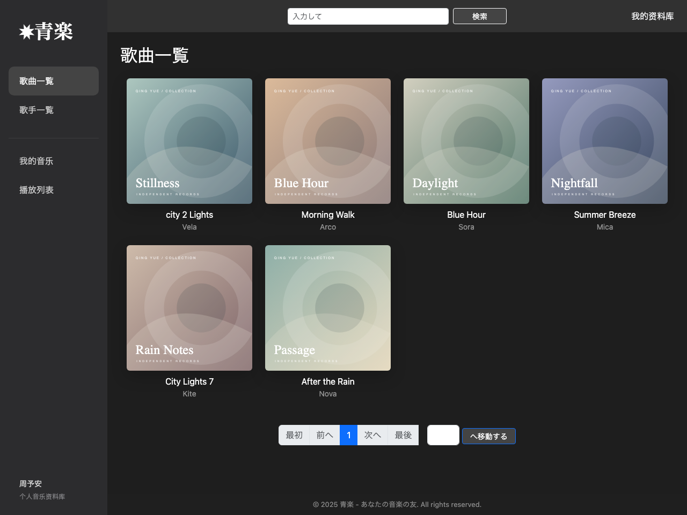
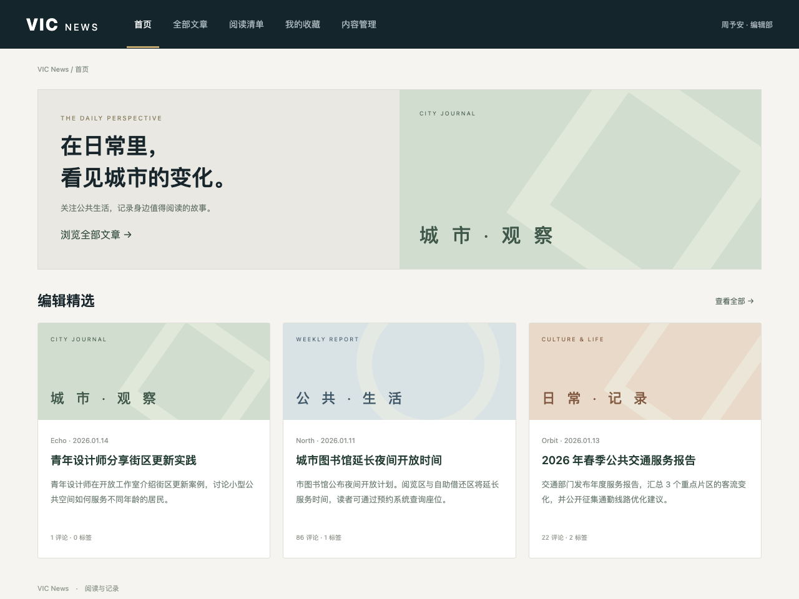
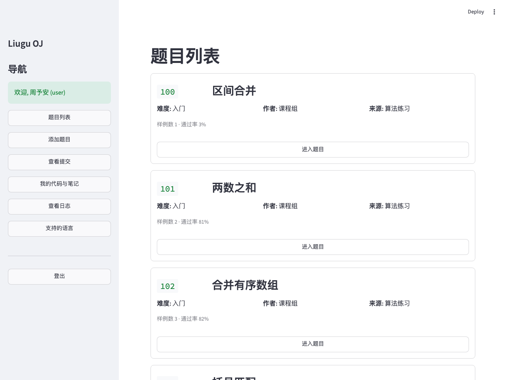
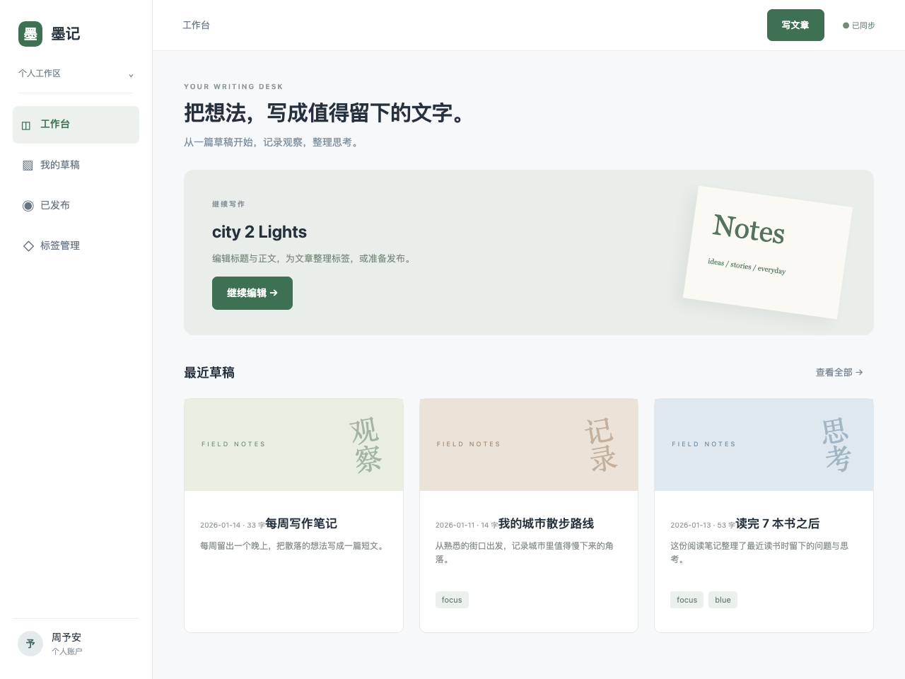
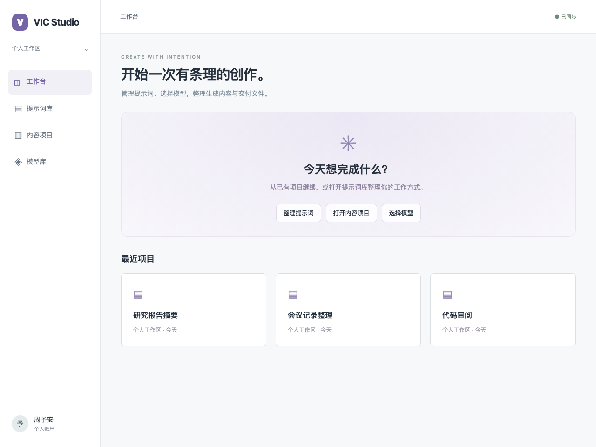
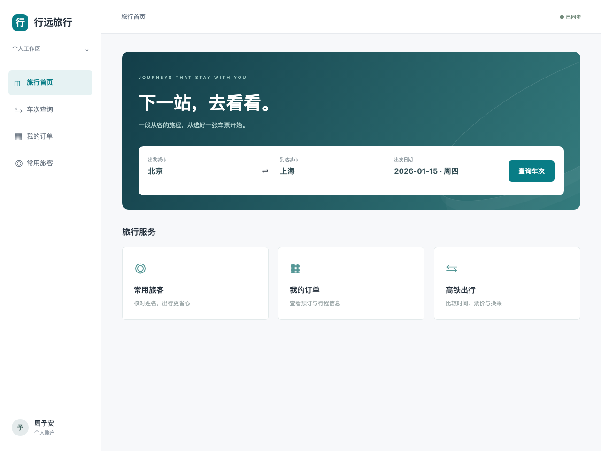
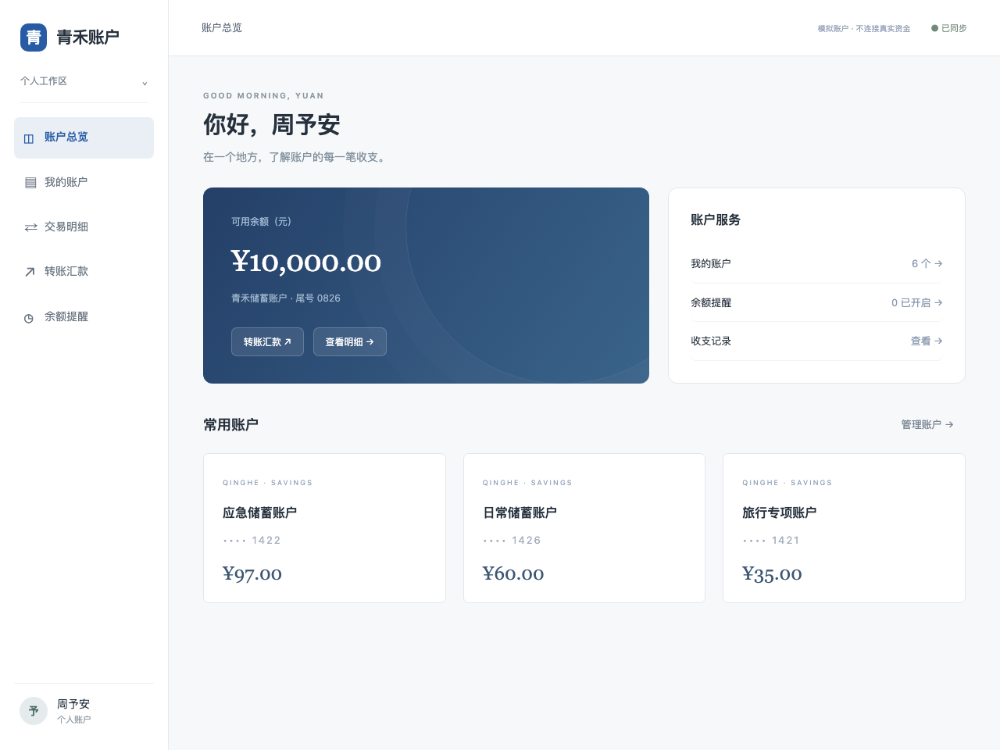
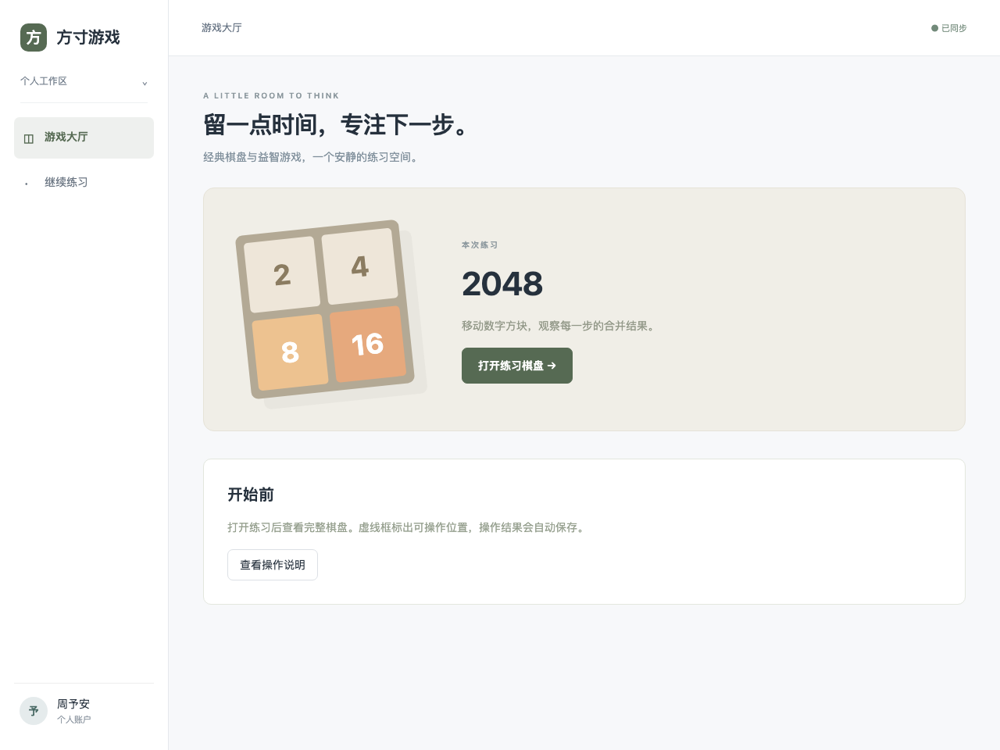

# 应用界面与任务流程

统一团队入口：[VideoICL 工作台](http://127.0.0.1:18765/)。通过 Agentlab SSH 隧道访问，操作说明见 [团队访问](agentlab.md)。GitHub 保存代码、构建说明、任务契约和界面预览；实际应用在服务器运行。

每个任务从“应用工作台 → 打开应用 → 默认首页 → 导航 → 业务操作”开始。录制必须包含这条路径。图中展示的是自动化检查实际打开的页面。

## 来源应用

| 应用 | 前端来源 | 任务 |
|---|---|---|
| Chat | VIC-Chat 的 React/Vite 布局、会话、通讯录、消息菜单和编辑器 | 1–14 |
| IM | VIC-IM 的 Next.js、Ant Design 消息与群聊页面 | 15–16 |
| Music | VIC-Music 的 Django 首页、歌曲与歌手模板，附资料库整理功能 | 17、18、22、27、28、32 |
| News | VIC-News 新闻页面资源，附阅读清单、分类和编辑功能 | 19、20、23、24、29、30、33 |
| Code | VIC-Code 的 Streamlit 题目、导航和提交页面，附代码笔记功能 | 58–65 |
| 五子棋 | VIC-gomuku 的 C++/SDL 程序、字体与棋盘绘制，附练习棋谱入口 | 66–67 |

### Chat

### IM

### Music

### News

### Code

### 五子棋

## 新增应用

| 应用 | 首页与导航 | 核心业务 |
|---|---|---|
| 映像放映室 | 发现、资料库、稍后观看、播放队列、历史、收藏夹 | 真实 MP4 播放、分类、选择、排序与观看列表整理 |
| 墨记 | 工作台、草稿、已发布、标签 | 文章标题编辑、分类、发布与产物保存 |
| VIC Studio | 工作台、提示词库、内容项目、模型库 | 模板保存、内容分类、模型选择、代码检查、复制和交付 |
| 行远旅行 | 旅行首页、车次查询、订单、常用旅客 | 旅客姓名、行程比较、标签、选择与预订回执 |
| 拾物商店 | 发现、商品详情、购物车、收藏 | 订单备注、商品分类、选购及集合更新 |
| 青禾账户 | 总览、账户、交易明细、转账、余额提醒 | 备注、分类、明细查看、转账回执、提醒与余额变化 |
| 方寸游戏 | 游戏大厅、练习棋盘 | 2048、数独、扫雷、黑白棋的可重放操作 |

### 映像放映室

### 墨记

### VIC Studio

### 行远旅行

### 拾物商店

### 青禾账户

### 方寸游戏

## 任务内容与交互

任务说明包含操作对象、业务目的及公共参数；输入资料使用联系人、完整消息、文章、歌曲、商品、行程、账户或代码内容。示范中的私有规则版本不进入业务接口。

消息标签、新闻分类及产品分类使用页面内菜单；点击后写入业务状态并显示反馈，刷新后保留。附件提供可读取的文档字节。视频素材附带 [来源与许可](../apps/media/assets/ATTRIBUTION.md)。账户、订单和转账仅使用模拟数据。

## 验收边界

自动化检查覆盖任务所需的导航与业务路径；工程记录见 [前端验证](native-verification.json)。应用完整视觉验收、操作流畅度与正式教程由同事逐题复核，任务大厅标记为“待人工验收”。来源仓库中未接入任务适配器的功能，不计入任务路径的自动化通过范围。

使用 [录制指南](recording-guide.md) 完成人工录制。系统任务 76–100 暂缓。独立源应用可由 `infra/compose.native.yaml` 启动；团队任务环境使用 `infra/compose.yaml`。
